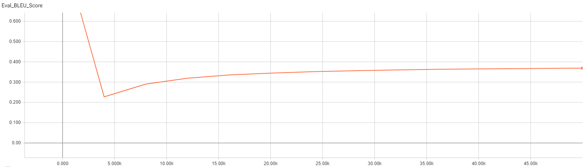
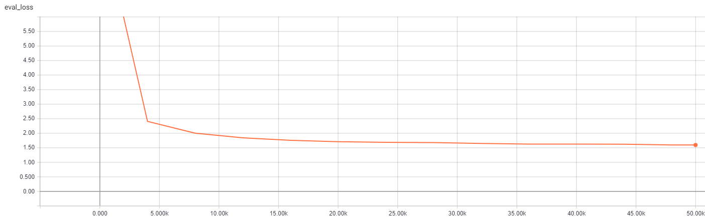
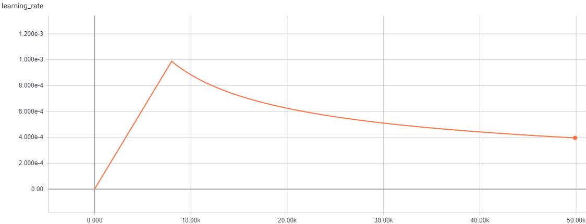

### Submission
- Please submit the nohup.out file along with screenshots of your Tensorboard indicating training progress (Blue score, eval loss) over time. Also, answer the following (simple) questions:

- How long does it take to complete the training run? (hint: this session is on distributed training, so it will take a while)
  * **The training run took approximately 22hr to complete.**

- Do you think your model is fully trained? How can you tell?
  * **Model is not fully trained at 50K steps, since the best model (i.e., lowest val loss) is the final one after 50K steps.  Original configuration was set to run for 300K training steps, which suggests that 50K is insufficient for achieving the optimal model.**

- Were you overfitting?
  * **No, model is not overfitting since eval loss is still trending downwards after 50K training steps.**

- Were your GPUs fully utilized?
  * **Yes, all GPUs were fully utilized.**

- Did you monitor network traffic (hint: apt install nmon ) ? Was network the bottleneck?
  * **Yes, network appeared to be maxed out at VSI limit of 1Gb/s, according to nmon.**

- Take a look at the plot of the learning rate and then check the config file. Can you explain this setting?
  * **The config file specifies the (warmup_steps) value to be 8000, which is exactly the point (i.e., number of training steps) when the learning rate peaks in the plot.**

- How big was your training set (mb)? How many training lines did it contain?
  * **The training set (/data/wmt16_de_en/train.clean.en.shuffled.BPE_common.32K.tok) is 915MB in size and has 4,524,868 lines.**

- What are the files that a TF checkpoint is comprised of?
  * **TF checkpoint is comprised of following 3 files: model.ckpt-50000.index, model.ckpt-50000.data-00000-of-00001, model.ckpt-50000.meta**

- How big is your resulting model checkpoint (mb)?
  * **Resulting model checkpoint is about 800MB in size.**

- Remember the definition of a "step". How long did an average step take?
  * **Average time per step is 1.588 seconds.**

- How does that correlate with the observed network utilization between nodes?
  * **Average time per step is correlated to the latency of the network between the two VSI's.  Faster network would reduce the average time per step.**
  
